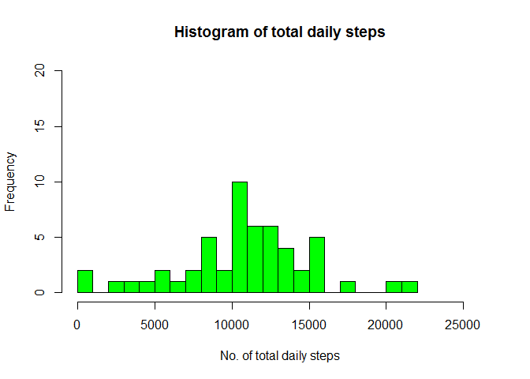
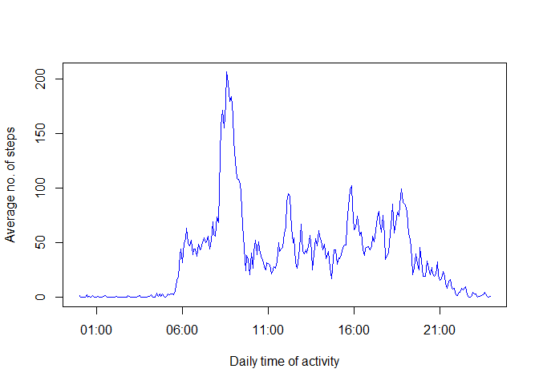
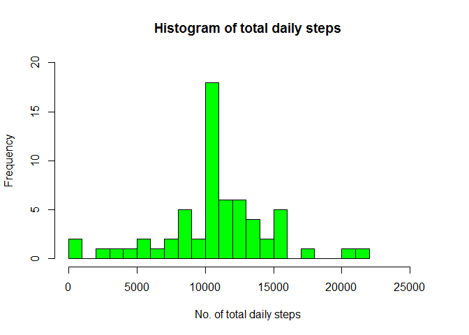
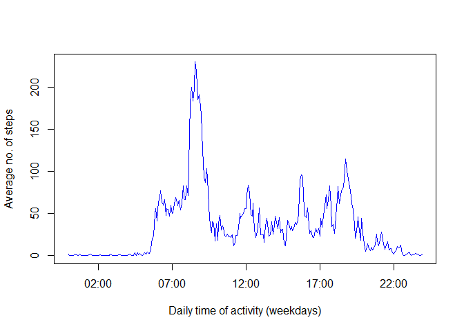
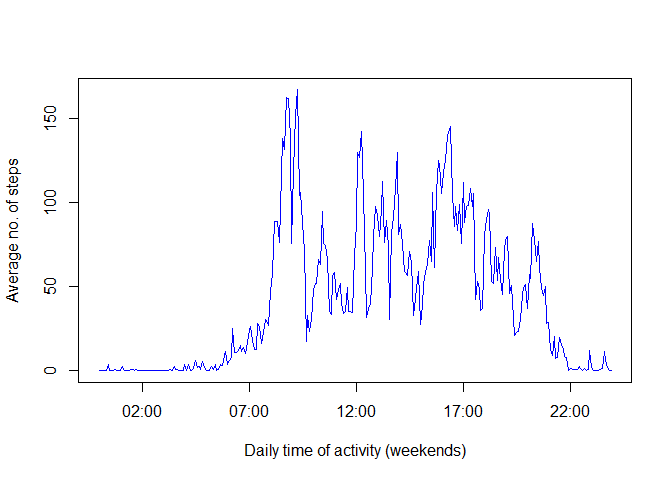

# Reproducible Research: Peer Assessment 1
Author: Hendrik L., Switzerland  
Date of Creation: `r Sys.Date()`  


&nbsp;

----- 
   
## General description
Based on some data created by a devices belonging to the "quantified self"
movement, the following report from August 2015 shows research results 
according to the Peer Assessment 1 assignment of the JHU/Coursera course 
"Reproducible Research".

The complete assignment can be found here: [Link](https://class.coursera.org/repdata-031/human_grading/view/courses/975144/assessments/3/submissions)

-----   

&nbsp;

### Loading the data

```r
actZipFilepath <- "./activity.zip"
actFilename <- "activity.csv"
actData <- read.csv(unz(actZipFilepath, actFilename))
```

### Preprocessing the data

```r
# reformat date and time data according to Posix standard
tempDate <- actData$date

# fill up the intervall with zeros
tempIntv <- str_pad(actData$interval, 4, pad = "0")
tempDateIntv <- paste(tempDate, tempIntv)

# create date and interval start time according to POSIXct standard
actData <- cbind(actData[1], strptime(tempDateIntv, "%Y-%m-%d %H%M"))
names(actData)[ncol(actData)] <- "date_interval"
```

### Create a histogram of total daily steps

```r
# calculate the total daily steps while ignoring NAs (according to assignm.)
actDataTemp <- actData %>%
    separate(col = date_interval, 
        into = c("date", "intervalStartTime"), sep = " ") %>%
    select(date, steps) %>%
    group_by(date) %>%
    filter(!is.na(steps)) %>%
    summarize(totalSteps = sum(steps))

# calculate the range of total daily steps
rangeCeiling <- (abs(max(actDataTemp$totalSteps)/5000) + 1) * 5000
rangeTotalSteps <- c(min(actDataTemp$totalSteps), rangeCeiling)

# plot the histogram
Cairo(type = "png", bg = "white")
hist(actDataTemp$totalSteps, col = "green", breaks = rangeCeiling/1000, 
    main = "Histogram of total daily steps",
    xlab = "No. of total daily steps",
    xlim = rangeTotalSteps,
    ylim = c(0, 20))    
```

 

### Mean of the no. of total daily steps:

```
## [1] 10766.19
```

### Median of the no. of total daily steps:

```
## [1] 10765
```

&nbsp;

### What is the average daily activity pattern?   

```r
# calculate the average daily steps based on the 5-minute intervals
# while ignoring NAs (according to assignm.)
actDataTemp <- actData %>%
    separate(col = date_interval, 
        into = c("date", "intervalStartTime"), sep = " ") %>%
    group_by(intervalStartTime) %>%
    filter(!is.na(steps)) %>%
    summarize(avStepsPerInterval = mean(steps))

# do the time series plot for average steps per 5-minute interval
xData <- strptime(actDataTemp$intervalStartTime, "%H:%M:%S")
yData <- actDataTemp$avStepsPerInterval
Cairo(type = "png", bg = "white")
plot(xData, yData, type = "l", col = "blue",  
     xlab = "Daily time of activity", 
     ylab = "Average no. of steps")
```

 

### 5-minute  interval which contains the maximum average no. of steps:   

```
## [1] "the 5-minute interval beginning at: 08:35:00"
```

&nbsp;

### Imputing missing values

```r
# Calculating the no. of rows with missing values
naRowsActData <- actData %>%
    filter(is.na(actData$steps))
print(paste("No. of rows with NA values:", nrow(naRowsActData), 
    "of total", nrow(actData), "rows"))
```

```
## [1] "No. of rows with NA values: 2304 of total 17568 rows"
```

### Strategy for handling missing values
Generally, we cannot know what the true values could have been. So, replacing a missing value with the mean-value of that interval seems to be a reasonable approach. However, considering the weekday could make sense, too, because many people have weekly routines. On the other hand, we do not know whether the observed person rather has  weekly routines than daily. Hence, just using mean values seems to be ok, given the lack of knowledge about the observed person's behavior and routines.

### Create a histogram with NA values replaces by mean-values

```r
# Create a dataset in which NAs are replaced with the mean-values
# of the respective interval
intervStartTime <- actDataTemp$intervalStartTime
averageNoSteps <- actDataTemp$avStepsPerInterval
cleanedData <- actData
tempInterval <- as.character(actData[, 2])
tempInterval <- strsplit(tempInterval, " ")
tempInterval <- unlist(tempInterval, recursive = TRUE)
k <- 0

for (i in 1:nrow(cleanedData)) {
    if (is.na(cleanedData$steps[i])) { 
        k <- k + 2
        searchedTime <- tempInterval[k]
        for (j in 1:length(intervStartTime)) {
            if (intervStartTime[j] == searchedTime) {
                cleanedData$steps[i] <- averageNoSteps[j]
}}}}

# calculate the total daily steps while ignoring NAs (according to assignm.)
actDataTemp <- cleanedData %>%
    separate(col = date_interval, 
        into = c("date", "intervalStartTime"), sep = " ") %>%
    select(date, steps) %>%
    group_by(date) %>%
    filter(!is.na(steps)) %>%
    summarize(totalSteps = sum(steps))

# calculate the range of total daily steps
rangeCeiling <- (abs(max(actDataTemp$totalSteps)/5000) + 1) * 5000
rangeTotalSteps <- c(min(actDataTemp$totalSteps), rangeCeiling)

# plot the histogram
Cairo(type = "png", bg = "white")
hist(actDataTemp$totalSteps, col = "green", breaks = rangeCeiling/1000, 
    main = "Histogram of total daily steps",
    xlab = "No. of total daily steps",
    xlim = rangeTotalSteps,
    ylim = c(0, 20))
```

 

### Mean of the no. of total daily steps:

```
## [1] 10766.19
```

### Median of the no. of total daily steps:

```
## [1] 10766.19
```

### Impacts of imputing missing values (i.e., replacing NAs with mean-values) 
1. The mean values remains the same.
2. The median values is now equal to the mean value.
3. The highest no. of daiy steps in the histogram (i.e., the bar that shows 10,000 to 11,000 steps) grew significantly.


&nbsp;

### Are there differences in act patterns between weekdays and weekends?

```r
# add a distinction between weekday and weekends
cleanedData <- cleanedData %>% 
    mutate(day_type = "")
weekdays1 <- c('Montag', 'Dienstag', 'Mittwoch', 'Donnerstag', 'Freitag')
#Use `%in%` and `weekdays` to create a logical vector
#convert to `factor` and specify the `levels/labels`
cleanedData$day_type <- 
    factor((weekdays(cleanedData$date_interval) %in% weekdays1), 
           levels = c(FALSE, TRUE), labels = c('weekend', 'weekday'))

# calculate the average daily steps based on the 5-minute intervals
# for weekday and weekends
cleanedData <- cleanedData %>%
    separate(col = date_interval, 
             into = c("date", "intervalStartTime"), sep = " ") %>%
    group_by(day_type, intervalStartTime) %>%
    filter(!is.na(steps)) %>%
    summarize(avStepsPerInterval = mean(steps))

cleanedDataWD <- cleanedData %>%
    filter(day_type == "weekday")

cleanedDataWE <- cleanedData %>%
    filter(day_type == "weekend")

# do the time series plot for average steps per 5-minute interval
# for weekdays
xData <- strptime(cleanedDataWD$intervalStartTime, "%H:%M:%S")
yData <- cleanedDataWD$avStepsPerInterval
Cairo(type = "png", bg = "white")
plot(xData, yData, type = "l", col = "blue",  
     xlab = "Daily time of activity (weekdays)", 
     ylab = "Average no. of steps")
```

 

```r
# do the time series plot for average steps per 5-minute interval
# for weekends
xData <- strptime(cleanedDataWE$intervalStartTime, "%H:%M:%S")
yData <- cleanedDataWE$avStepsPerInterval
Cairo(type = "png", bg = "white")
plot(xData, yData, type = "l", col = "blue",  
     xlab = "Daily time of activity (weekends)", 
     ylab = "Average no. of steps")
```

 
